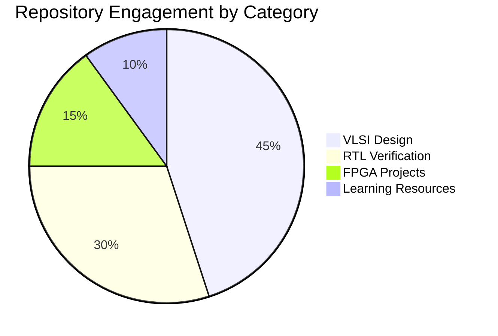

  

# Hi 👋, I'm HARI HEMANTH

  

---

## 🚀 About Me

- 🎓 Passionate **VLSI Design Engineer** with expertise in **RTL Design & Verification**
- 💡 Specialized in **Digital Circuit Design**, **FPGA Development**, and **Hardware Description Languages**
- 🔬 Focused on creating efficient and optimized digital systems
- 🌱 Currently expanding knowledge in **Advanced Verification Methodologies** and **Low-Power Design Techniques**

---

## 💼 Current Work

- 🔭 Working on **VLSI Design Projects** involving complex digital architectures
- 🚀 Developing **100 Days of Verilog** challenge to master HDL fundamentals
- 📐 Designing and verifying **RTL modules** for real-world applications
- 🎯 Building expertise in **ASIC Design Flow** and **Synthesis Optimization**

---

## 📚 Learning & Knowledge

- 🌱 Currently mastering **SystemVerilog**, **UVM Testbenches**, and **Formal Verification**
- 📖 Exploring **Advanced Digital Design Patterns** and **FPGA Architecture**
- 🔧 Learning **EDA Tools**: Cadence, Synopsys, Xilinx Vivado, ModelSim
- 💻 Programming: **Verilog**, **SystemVerilog**, **Python**, **C**, **TCL Scripting**

---

## 📞 Contact Information

- 📫 Reach me at: **23a95a0425@aec.edu.in**
- 👨‍💻 Portfolio: [https://sites.google.com/view/harihemanth04/home](https://sites.google.com/view/harihemanth04/home)
- 📄 Resume: [View My Experience](https://drive.google.com/file/d/11k_ACQpoWl0eIWyWH5U0sGCouJuVW1TA/view?usp=sharing)

---

## ⚡ Fun Fact

  <em>I enjoy turning digital logic concepts into creative waveform art using Verilog HDL — blending technology and creativity on a single simulation screen!</em>

---

## 🌐 Connect with Me

            

---

# 📊 GitHub Analytics & Performance Metrics

## 📈 Contribution Activity Overview

  <em>Comprehensive visualization of my GitHub contributions and development activity</em>

---

## 📅 Annual Contribution Calendar

  <em>Year-over-year contribution patterns demonstrating consistent engagement</em>

---

## 🏆 GitHub Statistics Dashboard

  <em>Comprehensive metrics showcasing repository performance and coding patterns</em>

<table>
  <tr>
    <td align="center">
      
    </td>
    <td align="center">
      
    </td>
  </tr>
</table>

---

## 📊 Dynamic Language Usage Distribution

  <em>Real-time analysis of programming languages utilized across all repositories</em>

### 🔧 Technical Skills Breakdown

---

## 🎯 Repository Performance Analysis

  <em>Top repositories ranked by engagement metrics and technical significance</em>

### 📌 Featured Projects Pie Chart Distribution

---

## 🏅 GitHub Achievements & Trophies

  <em>Recognition and milestones earned through consistent contributions</em>

---

## 📉 Detailed Commit Analytics

  <em>Temporal distribution of development activity and code contribution patterns</em>

<table>
  <tr>
    <td align="center">
      
    </td>
    <td align="center">
      
    </td>
  </tr>
  <tr>
    <td align="center">
      
    </td>
    <td align="center">
      
    </td>
  </tr>
</table>

---

### 🎯 *"Design is more than logic — it's creativity on silicon!"*

**Thank you for visiting my profile! 😊**

